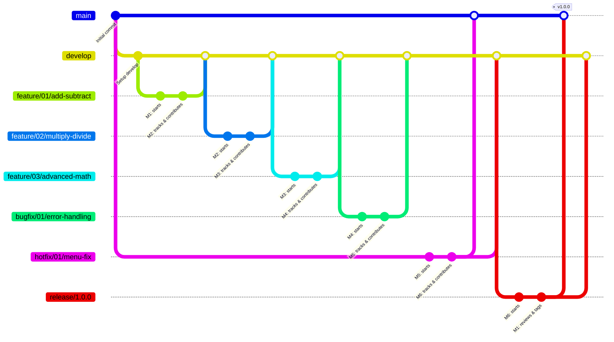

# Git-Flow Track Command Analysis (Pair Collaboration)

> **Project:** Python Git-Flow Calculator (`scenario03`)  
> **Version:** 0.1.0  
> **Number of Members:** 6 (Working in Pairs)

---

## 📌 Pair Assignments

| Issue | Member A (Starts) | Member B (Tracks) | Branch Name |
| :--- | :--- | :--- | :--- |
| **#01** | M1 (Leader) | M2 | `feature/01/add-subtract` |
| **#02** | M2 | M3 | `feature/02/multiply-divide` |
| **#03** | M3 | M4 | `feature/03/advanced-math` |
| **#04** | M4 | M5 | `bugfix/01/error-handling` |
| **#05** | M5 | M6 | `hotfix/01/menu-fix` |
| **#06** | M6 | M1 (Leader) | `release/1.0.0` |

---

## ⚙️ Collaborative Git-Flow Commands

### Scenario: Issue #01 (M1 & M2)

1. **M1 (Starts & Publishes)**:
   ```bash
   git flow feature start 01/add-subtract
   git flow feature publish 01/add-subtract
   ```

2. **M2 (Tracks)**:
   ```bash
   git flow feature track 01/add-subtract
   ```

3. **M1 & M2 (Collaborate)**:
   ```bash
   # Both use standard git commands to sync
   git add .
   git commit -m "feat/01: adding logic"
   git push origin feature/01/add-subtract
   git pull origin feature/01/add-subtract
   ```

4. **Finishing**:
   Once both are satisfied and the PR is approved:
   ```bash
   git flow feature finish 01/add-subtract
   ```

---

## 🧭 Collaboration Flow Diagram



---

## ✅ Summary: Why Pairs?

By using pairs and the `track` command, the team practices:
1. **Remote Branch Syncing**: Learning that branches aren't just local.
2. **Push/Pull Discipline**: Keeping the shared branch up to date.
3. **Conflict Resolution**: Handling simultaneous edits on the same feature.
4. **Code Review**: Naturally occurred as partners work on the same code.
